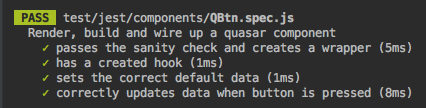
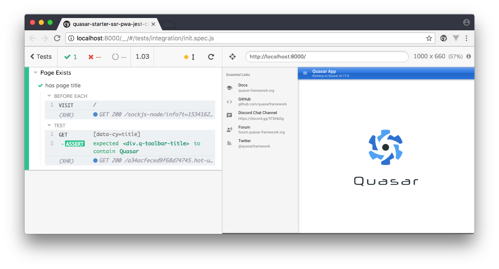
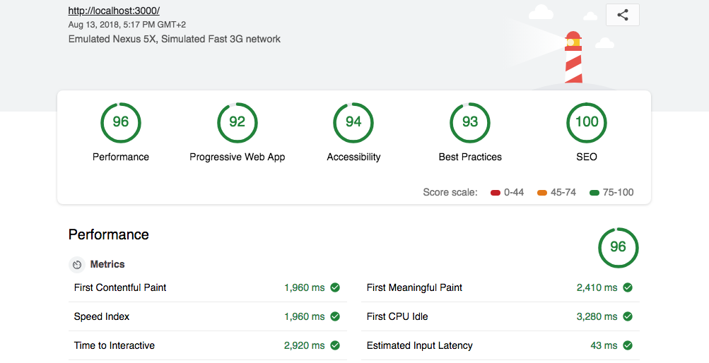

Accelerated starter kit for building a quasar 0.17 SSR PWA Hybrid - with rigged and ready to extend DB server. Also possible to be used for SPA development or without SSR. 

#### :fire: WARNING! :fire:
>Using this starter assumes familiarity with the command line, git, node, vue, quasar and for the love of your sanity if you do not understand HTML, CSS or JS - then this is going to be much too complicated for you.
 
 **System prerequisites:**
- pretested on windows and mac
- linux will obviously work too
- node.js 8 LTS or 10 latest
- yarn > 1.9 (no guarantees if you prefer to use npm)
- nodemon for running the production SSR server 
- pm2 for deploying the SSR server in production
- ngrok if you want to share your work with colleagues

Clone this repo:
```bash
$ git clone git@github.com:nothingismagick/quasar-starter-ssr-pwa-jest-cypress.git example
$ cd example
$ yarn
# or if you want to install a database as well, eg:
$ git checkout graphql-prisma && yarn && cd server && yarn
```

## Get to work
There are a number of scripts available in the `/package.json` file that should make your life a little easier when working. Of course normal CLI commands like `quasar dev` will still work, but power users of quasar swear by script invocation - especially if you plan to use a CI pipeline.

## Backend
We will maintain a number of branches in this repository that  allow you to choose the backend that you prefer:
- GraphQL with Prisma and Apollo (Working)
- Firebase (Coming Soon)
- hypertable (Help Wanted)
- pouchdb (Help Wanted)

### GraphQL
If you have never used GraphQL before, then we recommend that you [follow this entire tutorial](https://www.howtographql.com/graphql-js/0-introduction/). We are using the free service provided by Prisma to create a dynamic database proxy and running a local graphql-yoga server that is based on express and apollo.

#### Prisma Cloud Setup
First of all, make sure that you are on the right branch. You should have checked out `graphql-prisma`.

To get this all up and running, you will first need to create a free account at Prisma Cloud: https://app.prisma.io/login (You can use your Github account to make it easier.) After you have logged in, go to the `settings` page and copy the "Slug" - you will need this for the `.env` file you are about to make.

Copy or rename the file `/server/.env.template` to `/server/.env` and replace `YOUR_ACCOUNT_SLUG` with the slug you were given by the prisma app.

Now you can initialise prisma with a login & deploy.
```bash
$ yarn db:prisma:init
```

It is really worthwhile to check out the playground, because you can actually modify your schema there!

#### Serve a graphql-yoga server with nodemon
```bash
$ yarn db:graphql:serve
```

#### Deploy a graphql-yoga server with pm2
```bash
$ yarn db:graphql:serve
```

#### Important files
- server/database/datamodel.graphql
- server/database/seed.graphql
- src/layouts/MyLayout.vue

## Developing
To make an ssr version of this starter with hot-reloading webpack at `localhost:8000`, do this:
```bash
$ yarn dev:ssr
```

Please note, this script will increase the amount of memory available to the node process - so make sure that you really can afford to give node 4GB of memory. To read more about why, please visit [this Github issue](https://github.com/quasarframework/quasar-cli/issues/122).

Also, there have been recent reports that running webpack dev scripts (or any webpack-based commands for that matter) in the IDE can lead to 3x slower initial build time, which likely has to do with the way that Webstorm and VSCode attempt to register new files in the root.


### Meta Plugin

There is an example integration of the Quasar Meta Plugin available in `/src/layouts/MyLayout.vue`. It uses some of the examples from the quasar docs, most notably the `titleTemplate`.


### Linting and code style
This project assumes Standard style of JS. Also it uses an opinionated eslint caching and fixing strategy that you can change in `quasar.conf.js` if it becomes troublesome. There is also a helpful script that can sometimes save your life:
```bash
$ yarn lint:fix
```
If you are working with a colleague and encountering conditions where linting seems to change depending on OS or workstation, make sure that you don't have different versions of eslint installed globally and that your IDE's really are applying the right eslint settings.

## Testing
So you can see the website in your browser, but are you sure everything is working? This starter kit comes pre-rigged with Jest and Cypress as well as a highly volatile `.babelrc` configuration that includes all of the necessary babel modules. So if something breaks in like ten days when Babel releases a new beta, you are wise to make sure your Babel is configured correctly!

#### Unit tests
The configuration of Jest is in `/jest.config.js`. Do not put configurations anywhere else! There is a very simple example of a Jest unit test at `/test/unit/components/QBtn.spec.js` that checks to make sure that Vue is instantiated and that quasar components are available. To run it in a way that will constantly watch your tested files for changes (and update your coverage):
```bash
$ yarn test:unit:watch
```


#### Unit coverage
Coverage is set to run automatically at liberal high and low-water marks via the Jest config, and the lcov results can be found in the `/test/coverage` folder. See the "Serving" section below for a quick method to see your coverage results in the browser.

> We have noticed that there is a chance of Babel complaining that it can't find module './comments/inheritedLeadingComments'. Strangely it only happens once, on the first run of a coverage test and if you are using VS Code. Running the tests again will make the error disappear. To be on the safe side, we have added the `@babel/types` repo, which you can discover here: https://babeljs.io/docs/en/next/babel-types.html

#### e2e tests
The e2e we are using is Cypress, and the config is found at `/cypress.json`. There is a sample test called `init.spec.js`  that will run, but you obviously have to have the dev server running first.
```bash
$ yarn test:e2e
```

If you are smart, you will want to use Vue Devtools with Cypress. To find out how, see this resolved [issue at the Cypress repo](https://github.com/cypress-io/cypress/issues/1742).

#### Lighthouse tests
Lighthouse checks the quality of your PWA app, and although you can run it in any browser, there is really a great deal that you can do with it programmatically. Do not run this on a dev server - it will make you sad!
```bash
$ yarn test:lighthouse:ssr
```
To see your results you will need to serve the generated artifact. To do that see the section below. These are the results that will make you happy:



#### Webpack bundle
When you build your project, this starter will automatically run and build the webpack-bundle-analyzer that you can find at `http://localhost:8888` - in order to [modify its configuration](https://github.com/webpack-contrib/webpack-bundle-analyzer#options-for-plugin), you will need to create an appropriate object in `/quasar.conf.js` at `build.analyze`. If you want to turn it off, just comment out `analyze: true,`.

## Building
To build your SSR and PWA use this command. It places the artifacts at 
> `/dist/ssr-mat`
```bash
$ yarn build:ssr
```

## Serving
None of this means anything if you don't serve it to either your localhost (or the world). 

#### SSR & PWA
To serve your SSR node app and PWA, this starter kit assumes that you have **nodemon** preinstalled. You will find your site live at: 
> `localhost:3000`
```bash
$ yarn serve:ssr
```

#### Coverage
To keep track of your coverage, you can start a simple server with the `quasar serve` command that you can call with:
```bash
$ yarn serve:test:coverage
```
It will be available at `http://localhost:8788`

#### Lighthouse Results
To actually see the lighthouse results, you can start a simple server with the `quasar serve` command that you can call with:
```bash
$ yarn serve:test:lighthouse
```
It will be available at `http://localhost:8789`

#### NGROK Tunneling
Sometimes you may want someone at the other end of the office (or the planet) to be able to see the current state of what you are working on. This is what the free tool NGROK excels at. To serve the dev ssr version over ngrok, make sure that your dev server is running and use:
```bash
$ yarn serve:dev:ngrok
```

To serve the dist ssr version over ngrok, as above, make sure that you use:
```bash
$ yarn serve:dist:ngrok
```

> About NGROK: You may want to edit the command in the package.json in order to choose a server region closer to you [us, eu, au, ap]

### Deploy

There are a number of additional scripts here that will help you to deploy a pm2 managed instance of your SSR app. Please consult the pm2 documentation about the description of the individual commands. `pm2 examples` is a great way to find out more about it.

```yml
deploy:ssr-pm2
  pm2 start ./dist/ssr-mat/index.js --name quasar-ssr

deploy:ssr-pm2_clusterize
  pm2 start ./dist/ssr-mat/index.js --name quasar-ssr -i max
  
deploy:ssr-pm2_watch
  pm2 start ./dist/ssr-mat/index.js --name quasar-ssr --watch ./dist/ssr-mat

deploy:ssr-pm2_deep-monitoring
  pm2 start ./dist/ssr-mat/index.js --name quasar-ssr --deep-monitoring
  
deploy:ssr-pm2_restart
  pm2 restart quasar-ssr
  
deploy:ssr-pm2_stop
  pm2 stop quasar-ssr
  
deploy:ssr-pm2_monitor
  pm2 monitor quasar-ssr
  
deploy:ssr-pm2_unmonitor
  pm2 unmonitor quasar-ssr
  
deploy:ssr-pm2_kill
  pm2 kill  
```

## // TODO:
- [ ] vuex example binding
- [ ] firebase 
- [ ] hypertable
- [ ] pouchdb using https://github.com/pubkey/rxdb?


#### Final Notes:
Here is the redacted results of running `quasar info` in the project root at the time of the generation of this starter:
```
NodeJs                          8.11.3

Global packages                 
  NPM                           5.6.0
  yarn                          1.9.4
  quasar-cli                    0.17.11
  vue-cli                       2.9.6
  cordova                       8.0.0

Important local packages        
  quasar-cli                    0.17.11  
  quasar-framework              0.17.9  
  quasar-extras                 2.0.5   
  vue                           2.5.17 
  vue-router                    3.0.1   
  vuex                          3.0.1  
  @babel/core                   7.0.0-rc.1      
  webpack                       4.16.5  
  webpack-dev-server            3.1.5   
  workbox-webpack-plugin        3.4.1   
  register-service-worker       1.4.1   
```
#### Contributors
@nothingismagick
@kevinmarrec

#### License
©2018 to Present - D.C. Thompson and Razvan Stoenescu

MIT
